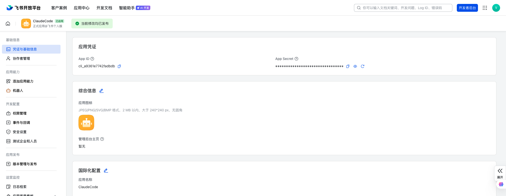
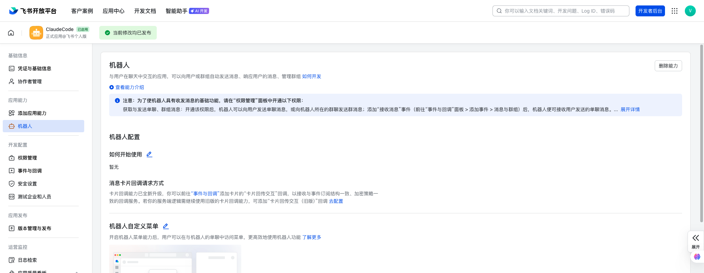
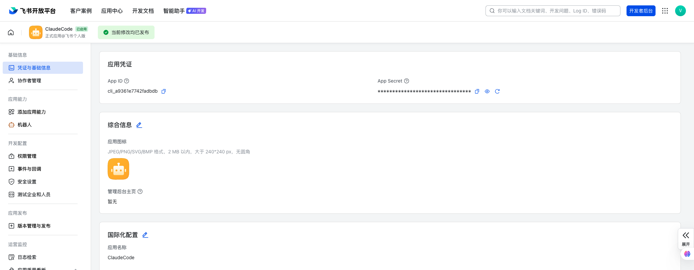
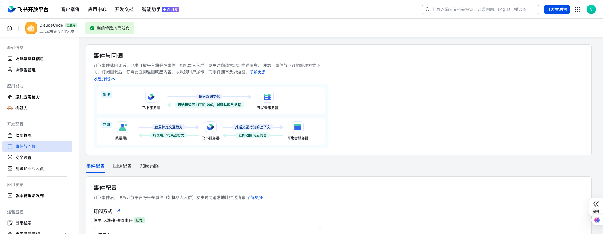

# Feishu Channel for Claude Code

Connect a Feishu (飞书) bot to your Claude Code with an MCP server.

The MCP server logs into Feishu as a bot and provides tools to Claude to reply,
react, or edit messages. When you message the bot, the server forwards the
message to your Claude Code session.

> 📖 [中文文档](README_CN.md)

## Prerequisites

- [Bun](https://bun.sh) — the MCP server runs on Bun. Install with
  `curl -fsSL https://bun.sh/install | bash`.

## Quick Setup

> Default pairing flow for a single-user DM bot. See [ACCESS.md](ACCESS.md)
> for groups and multi-user setups.

### 1. Create a Feishu bot

Go to [Feishu Open Platform](https://open.feishu.cn/app) → **Create Custom
App** (创建自建应用). Give it a name (e.g. "ClaudeCode") and description.

#### 1a. Copy credentials

Left menu → **Credentials & Basic Info** (凭证与基础信息):
- Copy **App ID** (`cli_xxx`) and **App Secret** — you'll need these in step 3.



#### 1b. Add bot capability

Left menu → **App Features** (应用能力) → **Bot** (机器人):
- Toggle **Enable Bot** on. This makes the app appear as a bot users can DM.



#### 1c. Configure permissions

Left menu → **Permissions & Scopes** (权限管理) → **API Permissions**:

| Scope | Description | Required |
|---|---|---|
| `im:message` | Read messages | ✅ |
| `im:message:send_as_bot` | Send messages as bot | ✅ |
| `im:resource` | Download images/files from messages | ✅ for photos |
| `im:message.reactions:write` | Add emoji reactions | Optional (for `ackReaction`) |
| `im:chat:readonly` | Read chat info | Optional |

Search each scope name and click **Activate** (开通).



#### 1d. Configure event subscriptions ⚠️

> **This step is critical.** If you skip it or choose the wrong subscription
> method, the bot can send messages but **cannot receive** them.

Left menu → **Event Subscriptions** (事件与回调):

1. **Subscription method** (订阅方式) — select **Long Connection** (使用长连接
   接收事件). This is the WebSocket mode, no public URL needed.
2. Click **Add Event** (添加事件) → search `im.message.receive_v1` → add it.
   The full name is "Receive Messages v2.0" (接收消息 v2.0).



#### 1e. Publish and approve

Left menu → **App Release** (版本管理与发布):
- Click **Create Version** (创建版本) → fill in version notes → **Submit**
  (提交发布).
- A Feishu **admin** in your organization needs to approve the release in the
  [Admin Console](https://feishu.cn/admin/appCenter/audit). For personal/test
  tenants where you are the admin, it may auto-approve.

> After any permission or event subscription change, you must **publish a new
> version** for it to take effect. This is easy to forget.


#### 1f. Verify the bot is live

Open Feishu → search your bot name → you should see it as a contact. If not,
check that the version is published and approved.

### 2. Install the plugin

These are Claude Code commands — run `claude` to start a session first.

First, register this repository as a plugin marketplace (only needed once):

```bash
claude plugin marketplace add V1ki/claude-feishu-plugin
```

Then install the plugin:

```bash
claude plugin install feishu@claude-feishu-plugin
```

Restart your session or run `/reload-plugins`. Check that `/feishu:configure`
tab-completes.

### 3. Save credentials

```
/feishu:configure cli_xxx your_app_secret
```

Writes `FEISHU_APP_ID=...` and `FEISHU_APP_SECRET=...` to
`~/.claude/channels/feishu/.env`. You can also write that file by hand, or set
the variables in your shell environment — shell takes precedence.

### 4. Launch with channel flag

Exit your session and start a new one:

```bash
claude --dangerously-load-development-channels plugin:feishu@claude-feishu-plugin
```

> **Note:** `--channels` requires the plugin to be on Claude's approved
> channels allowlist, which is not yet available for third-party plugins.
> Use `--dangerously-load-development-channels` instead — it has the same
> functionality but skips the allowlist check.

### 5. Pair

DM your bot on Feishu — it replies with a 6-character pairing code. In your
assistant session:

```
/feishu:access pair <code>
```

Your next DM reaches the assistant.

### 6. Lock it down

Pairing is for capturing IDs. Once you're in, switch to `allowlist` so
strangers don't get pairing-code replies:

```
/feishu:access policy allowlist
```

## Access control

See **[ACCESS.md](ACCESS.md)** for DM policies, groups, mention detection,
delivery config, skill commands, and the `access.json` schema.

Quick reference: IDs are **Feishu open_ids** (e.g. `ou_xxx`). Default policy
is `pairing`. `ackReaction` uses Feishu emoji types like `THUMBSUP`.

## Tools exposed to the assistant

| Tool | Purpose |
| --- | --- |
| `reply` | Send to a chat. Takes `chat_id` + `text`, optionally `reply_to` (message ID) for threading and `files` (absolute paths) for attachments. Images send as photos; other types as files. Max 50 MB. Auto-chunks long text. |
| `react` | Add an emoji reaction to a message by ID. Uses Feishu emoji types (`THUMBSUP`, `HEART`, `SMILE`, etc.). |
| `edit_message` | Edit a message the bot previously sent. Useful for progress → result updates. |

## Photos

Inbound photos are downloaded to `~/.claude/channels/feishu/inbox/` and the
local path is included in the `<channel>` notification so the assistant can
`Read` it.

## Lark (International) support

For the international version (Lark), set in your `.env`:

```
FEISHU_API_BASE=https://open.larksuite.com/open-apis
```

## How it works

The plugin uses the official
[@larksuiteoapi/node-sdk](https://github.com/larksuite/node-sdk) `WSClient`
to establish a WebSocket long connection with the Feishu Open Platform. This
means:

- **No public IP or domain needed** — works in local dev environments
- **No firewall / whitelist config** — just outbound internet access
- Authentication happens at connection time; subsequent events are plaintext

## Multiple Claude Code sessions

One Feishu bot = one WebSocket connection that receives events. Unlike
Telegram/Discord (where the newest connection automatically kicks the old one),
Feishu allows multiple connections to coexist but only delivers each event to
**one of them unpredictably**.

This plugin emulates the Telegram/Discord "last-writer-wins" behavior:

- **Newest session always takes over.** When a new session starts, it sends
  SIGTERM to the previous feishu server process and claims the WebSocket
  connection.
- **Old sessions keep reply tools.** The terminated server process exits
  cleanly; its Claude Code session loses inbound messages but can still use
  `reply` / `react` / `edit_message` via the Feishu REST API (no WebSocket
  needed for outbound).
- **Automatic cleanup.** When Claude Code exits, the server detects stdin
  close and shuts down, releasing the lock for the next session.

If you need truly independent sessions receiving from the same bot, create
separate Feishu apps (each with its own App ID / App Secret).

## Troubleshooting

**Bot sends messages but doesn't receive them**

Most common cause: event subscription not configured correctly.
1. Go to Feishu Open Platform → your app → **Event Subscriptions**
2. Confirm subscription method is **Long Connection** (长连接), not HTTP
3. Confirm `im.message.receive_v1` is listed under subscribed events
4. Make sure you **published a new version** after adding the event
5. Check for orphan processes: `ps aux | grep "bun.*server.ts"` — kill any
   stale ones

**Pairing code received, but subsequent messages don't arrive**

The plugin works. After pairing, close and restart Claude Code with the
`--dangerously-load-development-channels` flag.

**`reply failed: chat oc_xxx is not allowlisted`**

This happens on the first message after pairing. The fix is already included —
the `allowedChatIds` runtime set tracks `chat_id ↔ sender` mapping. If you
see this error, update to the latest plugin version.

**Multiple Claude Code sessions, only one receives messages**

Expected behavior — see [Multiple Claude Code sessions](#multiple-claude-code-sessions).
The newest session always takes over.

## Uninstall

```bash
claude plugin uninstall feishu
claude plugin marketplace remove claude-feishu-plugin
```
